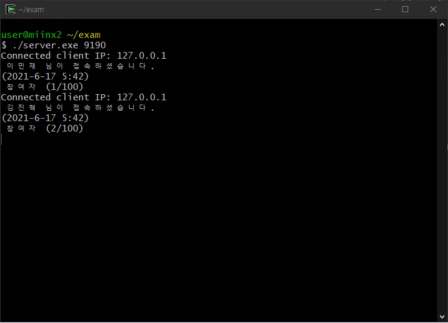
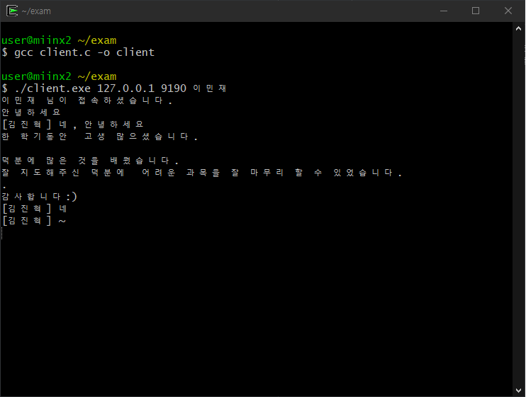
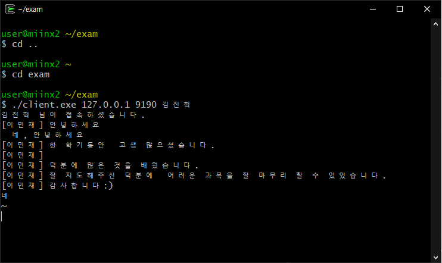

# 201744008 이민재
# 기말고사 과제물

// 개요

- TCP/IP 과목을 수강하면서 '채팅프로그램을 만들어보면 재미있을 것 같다'라는 생각을 가끔 하였습니다.
멀티쓰레드에 대해 배우고 이것을 활용하면 사용자들끼리 채팅을 주고 받는 프로그램을 개발 할 수 있겠다라고 생각하여 채팅프로그램을 구현하게 되었습니다.

// 목적

- 사용자들간의 자유로운 정보공유와 서로간의 친목 도모를 주 목적으로하여 프로그램을 개발하게 되었습니다.

// 설계 및 기능

- 사용자가 접속했을 때 서버에 사용자가 접속했다는 문구와 함께 시간과 현재 채팅방에 몇 명이 들어와있는지 나타내는 메세지를 출력합니다
- 사용자가 입력했을 시 상대방 화면에서는 메세지를 입력한 사용자의 이름과 입력한 메세지를 함께 출력합니다

// 미구현 기능

- 필터링 기능
사용자가 "개x끼", "시x", "병x"과 같은 욕설 메세지를 입력하였을때 그 부분만 "##"으로 보이게끔 필터링 기능을 구현하려고 하였습니다.
구현하는데 있어서 문자 배열안에 일정부분이 포함되어있는지를 확인하는 것 까지는 구현이 가능하였으나 
배열안에서 욕설로 인지되는 부분만 찾아서 ##으로 바꾸는 것에 있어서 해결책을 찾지 못하여 구현하지 못했습니다.

- 공지사항 기능
서버에서 클라이언트로 메세지를 전송하거나 사용자 입장시 공지사항을 알려주는 기능을 추가하려고 하였으나 사용자 본인이 입장시엔 출력이 되지만 
다른 사용자가 입장시에 공지사항이 출력되지 않았습니다. 이 부분에 있어서 어려움이 있어 원하는 기능을 완성하지 못하였습니다.

// 차이점

- 열혈강의 TCP/IP 소켓프로그래밍 (윤성우 저)책에 있는 채팅프로그램 소스코드를 응용하여 개발하였습니다.
- 본 책에 있는 코드는 client에서 다른 사용자의  client로 메세지를 보낼 경우 두 client에 '[사용자] msg'가 출력되게 구현되어 있었습니다.
- 저는 입력한 사용자의 client에서는 굳이 메세지를 출력할 이유가 없다고 생각하여 그 부분을 제거하는 코드를 추가하였습니다.
- server에서는 client가 server에 접속하면 접속한 IP주소만 출력하게 되어있었는데 사용자가 접속했다는 시간의 기록이 있으면 좋을 것 같다고 생각이 들었습니다.
그래서 client가 접속시 현재 채팅방에 들어와 있는 인원수와 함께 "user님이 접속하셨습니다 2021-6-17 6 : 08" 이렇게 출력하도록 코드를 추가하였습니다.
- 접속시 "user님이 접속하였습니다"라는 메세지가 출력하는 코드를 추가하였습니다 (30%구현)

// server.c

#include <stdio.h>
#include <stdlib.h>
#include <unistd.h>
#include <string.h>
#include <arpa/inet.h>
#include <sys/socket.h>
#include <netinet/in.h>
#include <pthread.h>
#include<time.h>

#define BUF_SIZE 100
#define MAX_CLNT 100
#define BUFFER_LEN 100

void * handle_clnt(void * arg);
void send_msg(char * msg, int len);
void error_handling(char * msg);

char namechk[BUF_SIZE] = "[DEFAULT]";

int clnt_cnt=0;
int clnt_socks[MAX_CLNT];
pthread_mutex_t mutx;

int main(int argc, char *argv[])
{
    int serv_sock, clnt_sock;
    struct sockaddr_in serv_adr, clnt_adr;
    int clnt_adr_sz;
    pthread_t t_id;
    
    char buffer[BUFFER_LEN];
    
    /** time log **/
    struct tm *t;
    time_t timer = time(NULL);
    t=localtime(&timer);

    if(argc!=2) 
   {
        printf("Usage : %s <port>\n", argv[0]);
        exit(1);
    }

    pthread_mutex_init(&mutx, NULL);
    serv_sock=socket(PF_INET, SOCK_STREAM, 0);

    memset(&serv_adr, 0, sizeof(serv_adr));
    serv_adr.sin_family=AF_INET;
    serv_adr.sin_addr.s_addr=htonl(INADDR_ANY);
    serv_adr.sin_port=htons(atoi(argv[1]));

    if(bind(serv_sock, (struct sockaddr*) &serv_adr, sizeof(serv_adr))==-1)
        error_handling("bind() error");
    if(listen(serv_sock, 5)==-1)
        error_handling("listen() error");

    while(1)
    {
        clnt_adr_sz=sizeof(clnt_adr);
        clnt_sock=accept(serv_sock, (struct sockaddr*)&clnt_adr,&clnt_adr_sz);

        pthread_mutex_lock(&mutx);
        clnt_socks[clnt_cnt++]=clnt_sock;
        pthread_mutex_unlock(&mutx);

        pthread_create(&t_id, NULL, handle_clnt, (void*)&clnt_sock);
        pthread_detach(t_id);

        read(clnt_sock, namechk, BUF_SIZE-1);
        printf("Connected client IP: %s \n %s 님이 접속하셨습니다.\n", inet_ntoa(clnt_adr.sin_addr), namechk);
        char buffer[BUFFER_LEN] = {0};
        sprintf(buffer, "%s 님이 접속하셨습니다.\n", namechk);
        write(clnt_sock, buffer, strlen(buffer));

        printf("(%d-%d-%d %d:%d)\n", t->tm_year+1900, t->tm_mon+1, t->tm_mday, t->tm_hour, t->tm_min);
        printf(" 참여자 (%d/100)\n", clnt_cnt);

    }
    close(serv_sock);
    return 0;
}

void * handle_clnt(void * arg)
{
    int clnt_sock=*((int*)arg);
    int str_len=0, i;
    char msg[BUF_SIZE];

    while((str_len=read(clnt_sock, msg, sizeof(msg)))!=0)
        send_msg(msg, str_len);

    pthread_mutex_lock(&mutx);
    for(i=0; i<clnt_cnt; i++)
    {
        if(clnt_sock==clnt_socks[i])
        {
            while(i++<clnt_cnt-1)
                clnt_socks[i]=clnt_socks[i+1];
            break;
        }
    }
    clnt_cnt--;
    pthread_mutex_unlock(&mutx);
    close(clnt_sock);
    return NULL;
}
void send_msg(char * msg, int len)   // send to all
{
    int i;
    pthread_mutex_lock(&mutx);
    /*if ( strstr(msg, "씨발") != NULL)
            msg = "####\n";
    else
            msg = msg;*/
    for(i=0; i<clnt_cnt; i++)
        write(clnt_socks[i], msg, len);
    pthread_mutex_unlock(&mutx);
}
void error_handling(char * msg)
{
    fputs(msg, stderr);
    fputc('\n', stderr);
    exit(1);
}

// client.c

#include <stdio.h>
#include <stdlib.h>
#include <unistd.h>
#include <string.h>
#include <arpa/inet.h>
#include <sys/socket.h>
#include <pthread.h>

#define BUF_SIZE 100
#define NAME_SIZE 20
#define BUFFER_LEN 100

void * send_msg(void * arg);
void * recv_msg(void * arg);
void error_handling(char * msg);

char name[NAME_SIZE]="[DEFAULT]";
char msg[BUF_SIZE];
char namechk[NAME_SIZE]="[DEFAULT]";

int flag = 0;
int main(int argc, char *argv[])
{
    int sock;
    struct sockaddr_in serv_addr;
    pthread_t snd_thread, rcv_thread;
    void * thread_return;
    if(argc!=4) {
        printf("Usage : %s <IP> <port> <name>\n", argv[0]);
        exit(1);
     }

    sprintf(name, "[%s]", argv[3]);
    sprintf(namechk, "%s", argv[3]);
    sock=socket(PF_INET, SOCK_STREAM, 0);

    memset(&serv_addr, 0, sizeof(serv_addr));
    serv_addr.sin_family=AF_INET;
    serv_addr.sin_addr.s_addr=inet_addr(argv[1]);
    serv_addr.sin_port=htons(atoi(argv[2]));

    if(connect(sock, (struct sockaddr*)&serv_addr, sizeof(serv_addr))==-1)
        error_handling("connect() error");

    write(sock, namechk, strlen(namechk));
    
    char buffer[BUFFER_LEN];
    int n = read(sock, buffer, BUFFER_LEN);
    buffer[n] = '\0';
    fputs(buffer, stdout);
    
    pthread_create(&snd_thread, NULL, send_msg, (void*)&sock);
    pthread_create(&rcv_thread, NULL, recv_msg, (void*)&sock);
    pthread_join(snd_thread, &thread_return);
    pthread_join(rcv_thread, &thread_return);
    close(sock);
    return 0;
}

void * send_msg(void * arg)   // send thread main
{
    int sock=*((int*)arg);
    char name_msg[NAME_SIZE+BUF_SIZE];
    while(1)
    {

        fgets(msg, BUF_SIZE, stdin);
        if(!strcmp(msg,"q\n")||!strcmp(msg,"Q\n"))
        {
            close(sock);
            exit(0);
        }
        sprintf(name_msg,"%s %s", name, msg);
        write(sock, name_msg, strlen(name_msg));
        flag = 1;
    }
    return NULL;
}

void * recv_msg(void * arg)   // read thread main
{
    int sock=*((int*)arg);
    char name_msg[NAME_SIZE+BUF_SIZE];
    int str_len;

    while(1)
    {
            str_len=read(sock, name_msg, NAME_SIZE+BUF_SIZE-1);
            if(str_len==-1)
                return (void*)-1;
            name_msg[str_len]=0;
            if (flag==1){
                flag = 0;
                continue;
            }
            fputs(name_msg, stdout);

    }
    return NULL;
}

void error_handling(char *msg)
{
    fputs(msg, stderr);
    fputc('\n', stderr);
    exit(1);
}

// 실행화면 // 
    
    
    
  </img>
  </img>
  </img>
  
